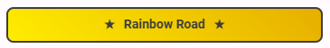
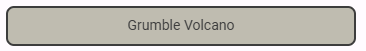

<!-- README.md is generated from README.Rmd. Please edit that file -->

```{r, include = FALSE}
knitr::opts_chunk$set(
  collapse = TRUE,
  comment = "#>",
  fig.path = "man/figures/README-",
  out.width = "100%"
)
```

```{r setup, echo = FALSE}
library(knitr)
```

<!-- badges: start -->
<!-- badges: end -->


### Overview

`shiny.reviewer` is an R package providing a configurable [shiny app](https://shiny.posit.co/)
that allows users to submit content reviews and interactively filter and view
content based on the most recent review. The can be used for different types of
content, such as educational courses, recipes, games, and books.

The package also includes helper methods to configure authentication for Google
Sheets, which enables persistent storage when deploying to services like
[shinyapps.io](https://shinyapps.io).


### Usage

To install this package, execute the following:

```{r eval = FALSE}
remotes::install_github("lanceupton/shiny.reviewer")
```

To run a simple example, execute the following:

```{r eval = FALSE}
library(shiny.reviewer)
reviewer <- ShinyReviewer$new(
  reviews = REVIEWS_EXAMPLE, 
  content_meta = CONTENT_META_EXAMPLE,
  group_meta = GROUP_META_EXAMPLE
)
reviewer$run_app(
  title = "Mario Kart Wii Track Logger",
  callback = function(df) {
    print(df)
  }
)
```

This creates and runs an application using the provided example content (Mario
Kart Wii tracks). This will work fine, but there is more work to do if we want
to synchronize data across application instances. There is where `callback`
comes in handy. The below boilerplate code creates an application that syncs
reviews to a Google Sheets file. It assumes that you have called
`DEV_auth_set()`, which creates an encrypted gs4 token.

```{r eval = FALSE}
library(shiny.reviewer)
library(googlesheets4)
DEV_auth_get()
# Read the Google Sheets file configuration
REVIEWS_SSID <- Sys.getenv("REVIEWS_SSID")
REVIEWS_SHEET <- Sys.getenv("REVIEWS_SHEET")
# Read the Google Sheets file
reviews <- read_sheet(ss = REVIEWS_SSID, sheet = REVIEWS_SHEET)
# Read custom metadata
content_meta <- read.csv("data-raw/CONTENT_META.csv")
group_meta <- read.csv("data-raw/GROUP_META.csv")
# Create and run the application
reviewer <- ShinyReviewer$new(
  reviews = reviews,
  content_meta = content_meta,
  group_meta = group_meta
)
reviewer$run_app(
  title = "Mario Kart Wii Track Logger",
  callback = function(df) {
    sheet_append(ss = REVIEWS_SSID, data = df, sheet = REVIEWS_SHEET)
  }
)
```    


### Features

**View Content**

The main interface includes a button for each content item, styled based on the
most recent review.

```{r, echo = FALSE}
kable(
  x = data.frame(
    c("Blacklisted (`blacklist=TRUE`)", "Top Rated (`rating=5`)", "Unreviewed (`timestamp=NA`)", "All Other Content"),
    c("", "", "", "")
  ),
  col.names = c("Content Class", "Content Preview")
)
```

Additionally, all content buttons display the emojis included within the `notes`
field of the most recent review.

**Filter Content**

The left sidebar includes an interface to filter content items based on the most
recent review.

The right sidebar includes an interface to search for content by title.

**Review Content**

A content button may be clicked to submit a review.


### Thanks

* [googlesheets4](https://googlesheets4.tidyverse.org/) - This makes it easy to
implement persistent data storage in remote environments.

* [shinyMobile](https://rinterface.github.io/shinyMobile/) - This is so easy to use, and provides beautiful
components.
